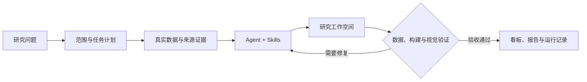

# QuantPilot

**面向量化研究的 Data Agent 工作台。** 用自然语言提出问题，结合真实行情、财务数据和版本化 Skills，生成带数据证据的研究看板，并在交付前完成构建、数据与视觉验证。

项目围绕「可信数据 → 可复现实验 → 持续研究 → 结果复盘」演进。当前以金融研究为主要业务域，通用 Data Agent 层负责组织任务、能力和交付，PI Agent 负责多轮执行，QuantPilot 负责权限、运行状态和结果验收。

[快速启动](#快速启动) · [第一次研究](#第一次研究) · [Skills](#skills从发现到维护) · [开发与验证](#开发与验证) · [完整文档](docs/README.md) · [路线图](docs/ROADMAP.md)

## 可以用它做什么

| 场景 | 当前能力 | 页面路径 |
| --- | --- | --- |
| 从问题开始研究 | 解析研究范围、取数、生成可运行看板，在项目中继续追问和修复 | `/` |
| 查看数据与策略 | 股票、ETF、指数、指标、数据覆盖、补数和单标的策略回测 | `/strategy-platform` |
| 持续跟踪观察池 | 汇集研究证据、生成日报、查看报告历史和推送回执 | `/research-reports` |
| 管理 Agent 技能 | 搜索、查看能力与兼容性、按项目安装、在线编辑、发布与回退 | `/skills` |
| 评估交付质量 | 管理评测集、执行评测、查看失败证据和运行报告 | `/eval-platform` |
| 排查运行问题 | 查看 Worker、队列、工作空间健康、日志和产品结果指标 | `/ops-platform` |
| 查阅业务能力 | 查看金融场景、数据依赖和交付规范 | `/business-knowledge` |

研究交付按下面的流程推进；验证失败会进入修复，最终以验收结果判断是否完成。



平台保留数据来源、运行记录和验证产物，便于复查一次交付。后台执行具备持久化任务、审批、配额、取消与故障接管；生成代码的构建和预览在 Linux namespace 沙箱内运行。实现细节见 [Data Agent 架构](docs/data-agent-architecture.md) 和 [PI Agent 治理边界](docs/pi-agent-migration.md)。

## 快速启动

本地开发采用 **Docker 运行基础组件，宿主机运行 Web 与市场数据服务**。以下命令均在仓库根目录执行。

### 1. 准备环境与依赖

- Node.js `>=22.19.0`、npm `>=10`。
- Python `>=3.14` 与 `uv`。
- Docker Engine 与 Docker Compose v2。
- 生成工作空间的构建和预览需要 Linux，且允许使用 `unshare` 的 user、mount、network、PID namespace。

```bash
npm ci
npm run ensure:env
uv sync --frozen --project services/market-data --extra baostock --extra akshare
```

安装脚本会创建缺失的 `.env` 和 `.env.local`。`.env` 保存本地基础设施配置，`.env.local` 保存凭据与个人覆盖；**不要把整份 `.env.example` 复制到 `.env.local`**。提前安装 Python 依赖可以避免首次启动时下载依赖超出服务健康检查时限。

### 2. 选择模型

将所选方式的凭据写入 `.env.local`：

| 接入方式 | 配置 | 模型选择 |
| --- | --- | --- |
| ModelPort | `MODELPORT_API_KEY=你的受限客户端凭据` | 默认使用本地 Qwen，也可选择经 ModelPort 的 DeepSeek |
| DeepSeek 官方直连 | `DEEPSEEK_API_KEY=你的官方凭据` | 在设置或新建项目时显式选择 `DeepSeek V4 Flash (Official Direct)` |

模型目录以 [config/llm.json](config/llm.json) 为准。ModelPort 模式需要单独运行 ModelPort 和所选模型服务；本仓库的 Compose 不会安装它们。直连模式不需要 ModelPort，但填写 Key 不会自动切换已有项目的模型。

如果暂未接入用户记忆或知识服务，可在 `.env.local` 关闭这两项独立集成：

```dotenv
QUANTPILOT_MEMORY_ENABLED=0
QUANTPILOT_KNOWLEDGE_ENABLED=0
```

完整模型配置、文件优先级和可选组件接入见 [配置指南](docs/configuration.md)。模型不可用时，研究规划会明确失败，不会用关键词解析冒充模型结果。

### 3. 启动 Docker 基础组件

先启动必需的数据库与缓存，等待就绪后初始化本地库：

```bash
docker compose up -d --wait timescaledb redis
npm run db:init
npm run db:doctor
```

需要本地分析层和集中日志时，可以直接启动全部组件：

```bash
mkdir -p .next tmp/runtime
docker compose up -d --wait
```

提前创建日志采集的挂载目录，避免 Docker 以 root 身份创建后影响本机写入。这组命令会增加 ClickHouse、Loki、Grafana 和 Alloy。ClickHouse 查询还需设置 `QUANTPILOT_CLICKHOUSE_ENABLED=1`；数据同步和降级规则见 [市场数据服务](services/market-data/README.md)。组件端口、数据卷和日志配置见 [基础设施指南](docs/infrastructure.md)。

`db:init` 用于本地首次初始化。生产发布使用版本化迁移，流程见 [生产发布手册](docs/release-runbook.md)。

### 4. 启动应用并检查

```bash
npm run dev
```

启动器会启动或复用市场数据服务，再启动 Web 和评测 Worker；使用 `PI_AGENT_DISPATCH_MODE=worker` 时还会托管本地 generation Worker。默认打开 **http://localhost:3000**；若端口占用，以终端输出为准，启动器会在 `3000–3099` 内选择可用端口。

另开终端检查服务，Web 端口如有变化请相应替换：

```bash
curl -fsS http://127.0.0.1:3000/api/health
curl -fsS http://127.0.0.1:3000/api/ready
curl -fsS http://127.0.0.1:8000/ready
```

健康接口确认服务状态，数据是否足够研究还需查看策略平台的覆盖与新鲜度。启动失败先运行 `npm run doctor`，再按 [故障排查](docs/troubleshooting.md) 定位。

本地模板默认关闭登录。需要多人使用或部署到可访问的服务地址时，先按 [认证与权限指南](docs/authentication.md) 配置用户、会话和权限。

## 第一次研究

1. 在首页创建项目，确认当前模型已配置并可用。
2. 提出范围明确的问题，例如：

   > 分析贵州茅台（600519）最近 120 个交易日的价格趋势、波动和最大回撤，生成研究看板，并标明数据来源、截止日期和缺失项。

3. 在项目中查看执行过程、生成页面和验证结果。数据覆盖不足时，先到策略平台检查与补数，再继续任务。
4. 核对图表时间范围、数据来源、限制说明和最终验收结果；通过追问迭代研究，或在投研情报中心建立观察池持续跟踪。

页面能打开只是第一步。交付是否有效，以当前任务的验证记录和 Mission 验收回执为准。工作空间内各类证据的含义见 [生成工作空间契约](docs/generated-workspace-contract.md)。

## Skills：从发现到维护

Skills Market 提供内置可信技能的搜索筛选、能力详情、兼容性说明、版本历史和项目安装状态。技能覆盖规划、标的解析、行情、财务、指标、回测、数据质量与可视化等研究环节。

- **按项目安装**：支持 PI Agent、Claude Code、Codex 的项目目录安装，可选择完整版本、卸载或回退安装集合；保护非平台管理的个人技能。
- **在线维护**：Studio 在隔离草稿中编辑源码和运行规则，保存与发布检查版本冲突，失败时保留编辑内容。
- **校验后发布**：校验包、元数据、脚本行为和运行规则后，保存完整快照并激活；项目固定版本不会随平台发布自动改变。
- **完整回退**：同时恢复技能源码、元数据和运行规则。缺少历史运行规则的旧包不能完整回退。

PI Agent 的实际执行读取平台保存的项目版本。Claude Code / Codex 当前验证范围是目录安装与完整性，真实工具调用兼容性仍需单独验收。

在线草稿、发布快照和安装记录保存在 `QUANTPILOT_SKILLS_STATE_DIR`，默认 `data/skill-catalog/`。生产环境应将其放在代码发布目录之外，由 Web 和 Worker 共享并备份。操作与权限说明见 [Skills 治理](docs/skills-governance.md)，编写方法见 [Skills 教程](docs/learning/07-skills-authoring.md)。

## 开发与验证

主要代码边界如下，具体依赖规则见 [项目结构](docs/project-structure.md) 与 [模块边界](docs/module-boundaries.md)。

```text
src/app/                 页面与 API 入口
src/lib/data-agent/      通用任务、业务组合与交付合同
src/lib/agent/           PI Agent 适配、执行治理与 Skills 编译
src/lib/domains/finance/ 金融语义、证券身份、研究规则与工具
src/lib/skills/          技能市场、草稿、发布与多 Agent 部署
src/components/skills/   技能界面；通用原语位于 components/ui/
src/lib/quant/           量化研究、策略与交付验证
src/lib/eval/            评测集、评测器与运行管理
services/market-data/    Python / FastAPI 数据服务
.pi/                    内置 Skills 基线、发布包与锁文件
prisma/ + sqls/          应用迁移与量化数据结构
scripts/ + deploy/      开发、检查、构建与部署配置
```

| 任务 | 命令 |
| --- | --- |
| 单独启动 Web / 数据服务 | `npm run dev:web` / `npm run dev:market` |
| 前端与后端测试 | `npm test` |
| 前端覆盖率检查 | `npm run test:coverage` |
| Skills 完整性与行为检查 | `npm run check:skills` |
| 桌面与移动端浏览器测试 | 先运行 `npx playwright install chromium`、`npm run build`，再运行 `npm run test:e2e` |
| 确定性发布质量检查 | `npm run release:check` |
| 独立部署包验证 | `npm run build:standalone`，然后运行 `npm run check:standalone-runtime` |
| 文档链接检查 | `npm run check:docs` |

`release:check` 覆盖静态检查、Skills、评测合同、单元测试、覆盖率、类型检查和构建。真实模型评测需要相应模型凭据与运行环境，不能由确定性检查替代；运行方式见 [评测指南](docs/evals-guide.md)。维护命令见 [运行手册](docs/operations-runbook.md)，发布与回滚见 [生产发布手册](docs/release-runbook.md)。

源码与业务数据分开管理：`data/projects/` 保存研究工作空间，`data/skill-catalog/` 保存 Skills 维护状态；数据库保存索引、状态与业务记录。凭据、工作空间、上传文件、构建产物和运行日志默认不提交 Git。清理或恢复前先查 [数据生命周期](docs/data-lifecycle.md)。

## 当前边界与下一步

- **数据**：已建立财报版本归档与截止时点查询，但历史回填、复权事件和历史行业成分尚未形成完整的 point-in-time 数据底座。
- **回测**：已有冻结输入、实现标识和离线复跑能力，目前仍以单标的简化执行模型为主；组合回测、容量约束和完整偏差治理继续推进。
- **评测**：合同测试、浏览器测试与真实模型任务验收分层进行；测试通过不代表所有金融场景或外部 Agent 都已验证。

当前交付、验收标准与后续优先级见 [路线图](docs/ROADMAP.md)。研究结果用于分析、复盘和辅助决策，不构成投资建议或收益承诺。

继续阅读：[文档总览](docs/README.md) · [系统学习路径](docs/learning/README.md) · [架构总览](docs/architecture.md)。项目许可证见 [MIT License](LICENSE)。
