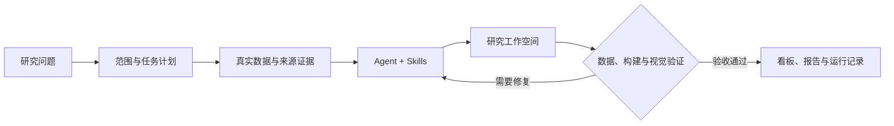

# QuantPilot

**面向量化研究的 Data Agent 工作台。** 用自然语言提出问题，结合真实行情、财务数据和版本化 Skills，生成带数据证据的研究看板，并在交付前完成构建、数据与视觉验证。

项目围绕「可信数据 → 可复现实验 → 持续研究 → 结果复盘」演进。当前以金融研究为主要业务域，通用 Data Agent 层负责组织任务、能力和交付，PI Agent 负责多轮执行，QuantPilot 负责权限、运行状态和结果验收。

[新手入口](#新手从这里开始) · [快速启动](#快速启动) · [第一次研究](#第一次研究) · [Skills](#skills从发现到维护) · [常见问题](#新手常见问题) · [学习路线](#循序渐进地学习) · [完整文档](docs/README.md)

## 新手从这里开始

第一次使用，只需要完成三个目标：**打开工作台 → 提交一个明确问题 → 核对生成结果**。先用一个标的做练习，再逐步使用策略、技能维护和评测功能。

| 你的目标 | 推荐入口 | 完成标志 |
| --- | --- | --- |
| 先了解产品，不配置模型 | 阅读下方能力介绍，完成快速启动中的依赖和基础组件配置 | 能打开首页、Skills 和策略平台；这一步不验证 AI 研究 |
| 跑通第一项研究 | [快速启动](#快速启动)，然后跟随[新手实操教程](docs/learning/first-research.md) | 能解释一个看板的数据来源、时间范围和验收状态 |
| 开始修改项目 | [项目结构](docs/project-structure.md) → [开发者教程](docs/learning/06-developer-playbook.md) | 找到修改位置，并通过对应质量检查 |

先认识几个常用词，后面读页面会轻松一些：

| 名称 | 在 QuantPilot 中是什么意思 |
| --- | --- |
| 项目 / 工作空间 | 一次持续研究的容器，保存问题、文件、数据和结果；可以回来继续追问 |
| Agent / Worker | Agent 执行分析和生成步骤；Worker 是在后台领取、执行任务的进程 |
| Skill | 某类工作的操作规范、参考资料和脚本，例如取行情、检查数据质量 |
| 证据 / 验收 | 证据说明数据从哪里来；验收检查本次交付是否满足要求 |

不必先读懂所有架构。第一轮只使用首页、项目页和必要的故障排查入口即可。

## 可以用它做什么

| 场景 | 当前能力 | 页面路径 |
| --- | --- | --- |
| 从问题开始研究 | 解析研究范围、取数、生成可运行看板，在项目中继续追问和修复 | `/` |
| 查看数据与策略 | 股票、ETF、指数、指标、数据覆盖、补数和单标的策略回测 | `/strategy-platform` |
| 持续跟踪观察池 | 汇集研究证据、生成日报、查看报告历史和推送回执 | `/research-reports` |
| 管理 Agent 技能 | 搜索、查看能力与兼容性、按项目安装、在线编辑、发布与回退 | `/skills` |
| 评估交付质量 | 管理评测集、执行评测、查看失败证据和运行报告 | `/eval-platform` |
| 排查运行问题 | 查看 Worker、队列、工作空间健康、日志和产品结果指标 | `/ops-platform` |
| 查阅业务能力 | 查看金融场景、数据依赖和交付规范 | `/business-knowledge` |

研究交付按下面的流程推进；验证失败会进入修复，最终以验收结果判断是否完成。



平台保留数据来源、运行记录和验证产物，便于复查一次交付。后台执行具备持久化任务、审批、配额、取消与故障接管；生成代码的构建和预览在 Linux namespace 沙箱内运行。实现细节见 [Data Agent 架构](docs/data-agent-architecture.md) 和 [PI Agent 治理边界](docs/pi-agent-migration.md)。

## 快速启动

本地开发采用 **Docker 运行基础组件，宿主机运行 Web、市场数据服务与 Workers**。Compose 提供数据库、缓存和观测组件；应用通过 `npm run dev` 启动。以下命令除克隆仓库外，均在仓库根目录执行。

还没有源码时，先运行；已有本地仓库可跳过：

```bash
git clone https://github.com/tiammomo/QuantPilot.git
cd QuantPilot
```

### 1. 准备环境与依赖

- Git、Node.js `>=22.19.0`、npm `>=10`；当前 CI 使用 Node.js 24。
- `uv` 与 Python `>=3.14`，可以用 `uv python install 3.14` 安装项目所需 Python。
- 已启动的 Docker Engine 与 Docker Compose v2。
- 完整生成和预览需要 Linux，并允许 `unshare` 的 user、mount、network、PID namespace。Windows 用户在 WSL2 Linux 环境中运行，并启用对应发行版的 Docker 集成；macOS 用户需要准备 Linux 执行环境。宿主机运行主应用不等于只启动 Docker 就满足沙箱要求。

先确认终端能找到这些工具：

```bash
git --version
node --version
npm --version
uv --version
docker compose version
docker info
```

如果出现 `command not found`，先安装对应工具；`docker info` 连接失败时，先启动 Docker。工具就绪后安装项目依赖：

```bash
npm ci
npm run ensure:env
npm run prisma:generate
uv sync --frozen --project services/market-data --extra baostock --extra akshare
npx playwright install chromium
```

安装脚本会创建缺失的 `.env` 和 `.env.local`。`.env` 保存本地基础设施配置，`.env.local` 保存凭据与个人覆盖；**不要把整份 `.env.example` 复制到 `.env.local`**。`prisma:generate` 生成数据库客户端，不初始化业务数据。提前安装 Python 依赖可以避免首次启动时下载依赖超出服务健康检查时限。

Chromium 用于生成页面的视觉验收和浏览器测试。Linux 上若提示缺少浏览器系统库，按错误提示安装依赖，或使用 `npx playwright install --with-deps chromium`（可能需要系统安装权限）。已有受管理浏览器的配置方式见[配置指南](docs/configuration.md)。

### 2. 选择模型

完成真实研究需要一个可用模型。暂时没有模型凭据，也可以继续启动和浏览页面；提交 AI 任务会失败，不会自动生成演示研究。

选择下面一种接入方式，将对应凭据写入 `.env.local`：

| 接入方式 | 配置 | 模型选择 |
| --- | --- | --- |
| ModelPort | `MODELPORT_API_KEY=你的受限客户端凭据` | 默认使用本地 Qwen，也可选择经 ModelPort 的 DeepSeek |
| DeepSeek 官方直连 | `DEEPSEEK_API_KEY=你的官方凭据` | 在设置或新建项目时显式选择 `DeepSeek V4 Flash (Official Direct)` |

模型目录以 [config/llm.json](config/llm.json) 为准。ModelPort 模式需要单独运行 ModelPort 和所选模型服务；本仓库的 Compose 不会安装它们。直连模式不需要 ModelPort，但填写 Key 不会自动切换已有项目的模型。

例如，已有 DeepSeek 官方凭据、尚未部署其他集成时，用编辑器修改 `.env.local` 中以下值；保留该文件已有的其他配置，不要把示例占位值当成真实 Key：

```dotenv
DEEPSEEK_API_KEY="替换为你的官方 API Key"
QUANTPILOT_MODELPORT_ENABLED=0
QUANTPILOT_MEMORY_ENABLED=0
QUANTPILOT_KNOWLEDGE_ENABLED=0
PI_AGENT_DISPATCH_MODE=worker
```

启动后仍需在首页输入框的模型选择器中选择 **DeepSeek V4 Flash (Official Direct)**。若使用 ModelPort，保留 `QUANTPILOT_MODELPORT_ENABLED=1`，填写 `MODELPORT_API_KEY` 并选择该网关提供的模型；Memory 和 Knowledge 可独立关闭。`PI_AGENT_DISPATCH_MODE=worker` 让 `npm run dev` 同时托管研究 Worker。

修改配置后重启应用。Compose 默认读取 `.env`，不读取 `.env.local`；首次使用保留自动生成的数据库端口与账号即可。

完整模型配置、文件优先级和可选组件接入见 [配置指南](docs/configuration.md)。模型不可用时，研究规划会明确失败，不会用关键词解析冒充模型结果。

### 3. 启动 Docker 基础组件

先启动必需的数据库与缓存，等待就绪后初始化本地库：

```bash
docker compose up -d --wait timescaledb redis
npm run db:init
npm run db:doctor
```

**成功标志**：`docker compose ps` 中数据库和 Redis 为运行且健康状态，`db:doctor` 未报告缺失的必需数据库对象。新库没有历史研究和行情覆盖是正常的；初始化结构不会下载全市场数据。

需要本地分析层和集中日志时，可以直接启动全部组件：

```bash
mkdir -p .next tmp/runtime
docker compose up -d --wait
```

提前创建日志采集的挂载目录，避免 Docker 以 root 身份创建后影响本机写入。这组命令会增加 ClickHouse、Loki、Grafana 和 Alloy。ClickHouse 查询还需设置 `QUANTPILOT_CLICKHOUSE_ENABLED=1`；数据同步和降级规则见 [市场数据服务](services/market-data/README.md)。组件端口、数据卷和日志配置见 [基础设施指南](docs/infrastructure.md)。

`db:init` 用于本地首次初始化。生产发布使用版本化迁移，流程见 [生产发布手册](docs/release-runbook.md)。

### 4. 启动应用并检查

```bash
npm run dev
```

启动器会启动或复用市场数据服务，再启动 Web 和评测 Worker；使用 `PI_AGENT_DISPATCH_MODE=worker` 时还会托管本地 generation Worker。默认打开 **http://localhost:3000**；若端口占用，以终端输出为准，启动器会在 `3000–3099` 内选择可用端口。

另开终端检查服务，Web 端口如有变化请相应替换：

```bash
curl -fsS http://127.0.0.1:3000/api/health
curl -fsS http://127.0.0.1:3000/api/ready
curl -fsS http://127.0.0.1:8000/ready
```

**成功标志**：终端出现 Web 可访问地址，以上检查返回 HTTP 200；Web 健康和就绪结果包含 `"ok": true`。运行 `npm run dev` 的终端需要保持打开，检查命令放在第二个终端执行。

健康接口确认服务状态，数据是否足够研究还需查看策略平台的覆盖与新鲜度。启动失败先运行 `npm run doctor`，再按 [故障排查](docs/troubleshooting.md) 定位。服务就绪也不代表模型凭据已通过真实调用验证。

本地模板默认关闭登录。需要多人使用或部署到可访问的服务地址时，先按 [认证与权限指南](docs/authentication.md) 配置用户、会话和权限。

### 5. 停止与下次启动

结束使用时，先在运行 `npm run dev` 的终端按 `Ctrl+C`。它会停止自己启动的应用进程；此前单独启动、被复用的服务仍需在各自终端停止。再按需停止 Docker 组件：

```bash
docker compose stop
```

下次使用时，不必重新克隆或初始化已有数据库：

```bash
docker compose up -d --wait timescaledb redis
npm run dev
```

如果此前启用了整套组件，用 `docker compose up -d --wait` 恢复全部。`stop` 保留容器和数据卷；不要把 `docker compose down -v` 或 `prisma:reset` 当成普通重启，它们会删除数据。

## 第一次研究

第一轮建议只研究一个标的，按「**标的 + 时间范围 + 指标 + 输出要求**」组织问题。完整的逐步演练和检查表见[从零完成第一项研究](docs/learning/first-research.md)。

1. 打开首页，在输入区选择已配置的模型，并选择 **生成看板**。**只做问答** 是另一种输出方式，不用于本教程的看板验收。
2. 输入下面的练习问题，然后点击 **开始研究**；系统会创建研究空间并进入项目页：

   > 分析贵州茅台（600519）最近 120 个交易日的价格趋势、波动和最大回撤，生成研究看板，并标明数据来源、截止日期和缺失项。

3. 查看实际执行阶段。若要求澄清，补充缺失条件；若提示模型或服务故障，先修复配置，再重试。不要重复点击提交来处理等待。
4. 看板出现后，核对下表。数据覆盖不足时，先到策略平台检查目标标的和时间范围，再按需要补数。

| 你要检查什么 | 合格的结果应该说明什么 |
| --- | --- |
| 标的与时间 | 代码确为 `600519`，实际数据起止时间和样本量清楚 |
| 数据来源 | 来自哪个数据源、何时获取，是否存在延迟或缺失 |
| 指标口径 | 波动、回撤的计算范围，以及价格是否复权 |
| 交付状态 | 当前任务通过验收，或清楚列出未通过项和限制 |

再用一个小追问练习迭代：

> 保持同一标的和时间范围，增加 MA20、MA60 与成交量图，并说明新增指标是否改变了趋势判断；数据不足时明确标注。

首次任务通过后，再尝试两标的比较，或到 `/research-reports` 建立观察池。此时再扩展问题，比一开始要求全市场扫描和复杂组合回测更容易核验。

页面能打开只是第一步。交付是否有效，以当前任务的验证记录和 Mission 验收回执为准。工作空间内各类证据的含义见 [生成工作空间契约](docs/generated-workspace-contract.md)。

## Skills：从发现到维护

Skills Market 提供内置可信技能的搜索筛选、能力详情、兼容性说明、版本历史和项目安装状态。技能覆盖规划、标的解析、行情、财务、指标、回测、数据质量与可视化等研究环节。

第一次使用可先在 `/skills` 搜索 `quant-market-data`，阅读能力详情；选中刚创建的项目与 **PI Agent** 后，再检查实际版本和安装状态。新项目会按平台规则准备所需内置技能，不必为了完成第一项研究逐个手工安装全部技能。

- **按项目安装**：支持 PI Agent、Claude Code、Codex 的项目目录安装，可选择完整版本、卸载或回退安装集合；保护非平台管理的个人技能。
- **在线维护**：Studio 在隔离草稿中编辑源码和运行规则，保存与发布检查版本冲突，失败时保留编辑内容。
- **校验后发布**：校验包、元数据、脚本行为和运行规则后，保存完整快照并激活；项目固定版本不会随平台发布自动改变。
- **完整回退**：同时恢复技能源码、元数据和运行规则。缺少历史运行规则的旧包不能完整回退。

PI Agent 的实际执行读取平台保存的项目版本。Claude Code / Codex 当前验证范围是目录安装与完整性，真实工具调用兼容性仍需单独验收。

在线草稿、发布快照和安装记录保存在 `QUANTPILOT_SKILLS_STATE_DIR`，默认 `data/skill-catalog/`。生产环境应将其放在代码发布目录之外，由 Web 和 Worker 共享并备份。操作与权限说明见 [Skills 治理](docs/skills-governance.md)，编写方法见 [Skills 教程](docs/learning/07-skills-authoring.md)。

## 新手常见问题

| 现象 | 先检查什么 | 下一步 |
| --- | --- | --- |
| `npm ci` 或 Python 安装失败 | Node/npm/uv 版本、下载网络、当前是否在仓库根目录 | [启动排查](docs/learning/01-quick-start.md) |
| 数据库无法连接 | Docker 是否启动，`docker compose ps` 是否健康，`.env` 端口是否与连接地址一致 | `npm run db:doctor` |
| `3000` 打不开 | 运行终端是否仍在，启动器是否选择了其他端口 | 使用终端打印的 URL |
| `8000` 启动超时 | Python 依赖是否已安装，端口是否被其他程序占用 | 单独运行 `npm run dev:market` 查看错误 |
| 填了 Key，仍访问 `38082` | 首页或项目是否仍选着默认 Qwen / ModelPort 模型 | 官方直连需显式选择 `Official Direct` |
| 规划失败或返回 `401/403` | 当前所选模型的凭据、服务地址与授权范围 | [模型配置](docs/configuration.md)；模型故障无需改写研究问题 |
| 一直排队 | Worker 模式下是否只启动了 `dev:web` | 使用 `npm run dev`，到 `/ops-platform` 查看 Worker 与队列 |
| 看板为空或没有最新数据 | 标的、日期、覆盖范围、数据源返回的限制 | 策略平台检查目标范围，按需补数 |
| 构建报 `unshare`，或视觉检查找不到浏览器 | Linux namespace 能力、Chromium 及系统依赖 | [沙箱与浏览器检查](docs/learning/01-quick-start.md#沙箱与浏览器检查) |
| Skills 保存提示版本冲突 | 编辑期间是否有其他修改 | 保留未提交内容，重新读取并核对差异；详见 [Skills 治理](docs/skills-governance.md) |

排障时提供命令、HTTP 状态码和已脱敏的报错即可，不要粘贴整份 `.env.local`。更多现象见[故障排查手册](docs/troubleshooting.md)。

## 循序渐进地学习

| 阶段 | 练习 | 阅读入口 |
| --- | --- | --- |
| 入门 | 跑通一个标的，读懂数据来源和验收结果 | [新手实操](docs/learning/first-research.md) |
| 理解数据 | 检查同一标的的覆盖、截止日期和缺失字段 | [市场数据与策略](docs/learning/03-market-data-and-strategy-platform.md) |
| 理解技能 | 查看一个 Skill 的能力、版本和项目安装状态 | [Skills 与看板](docs/learning/04-skills-and-visual-dashboard.md) |
| 学会复盘 | 选择一次失败任务，根据证据区分数据、模型和页面问题 | [评测与运维](docs/learning/05-evaluation-and-operations.md) |
| 参与开发 | 做一次小改动，运行对应检查，再理解完整链路 | [开发者教程](docs/learning/06-developer-playbook.md)、[技能编写](docs/learning/07-skills-authoring.md) |

完整课程见[教学目录](docs/learning/README.md)。已经知道要解决什么问题时，直接查[文档总览](docs/README.md)，不必按顺序读完。

## 开发与验证

主要代码边界如下，具体依赖规则见 [项目结构](docs/project-structure.md) 与 [模块边界](docs/module-boundaries.md)。

```text
src/app/                 页面与 API 入口
src/lib/data-agent/      通用任务、业务组合与交付合同
src/lib/agent/           PI Agent 适配、执行治理与 Skills 编译
src/lib/domains/finance/ 金融语义、证券身份、研究规则与工具
src/lib/skills/          技能市场、草稿、发布与多 Agent 部署
src/components/skills/   技能界面；通用原语位于 components/ui/
src/lib/quant/           量化研究、策略与交付验证
src/lib/eval/            评测集、评测器与运行管理
services/market-data/    Python / FastAPI 数据服务
.pi/                    内置 Skills 基线、发布包与锁文件
prisma/ + sqls/          应用迁移与量化数据结构
scripts/ + deploy/      开发、检查、构建与部署配置
```

| 任务 | 命令 |
| --- | --- |
| 单独启动 Web / 数据服务 | `npm run dev:web` / `npm run dev:market` |
| 前端与后端测试 | `npm test` |
| 前端覆盖率检查 | `npm run test:coverage` |
| Skills 完整性与行为检查 | `npm run check:skills` |
| 桌面与移动端浏览器测试 | 先运行 `npx playwright install chromium`、`npm run build`，再运行 `npm run test:e2e` |
| 确定性发布质量检查 | `npm run release:check` |
| 独立部署包验证 | `npm run build:standalone`，然后运行 `npm run check:standalone-runtime` |
| 文档链接检查 | `npm run check:docs` |

`release:check` 覆盖静态检查、Skills、评测合同、单元测试、覆盖率、类型检查和构建。真实模型评测需要相应模型凭据与运行环境，不能由确定性检查替代；运行方式见 [评测指南](docs/evals-guide.md)。维护命令见 [运行手册](docs/operations-runbook.md)，发布与回滚见 [生产发布手册](docs/release-runbook.md)。

源码与业务数据分开管理：`data/projects/` 保存研究工作空间，`data/skill-catalog/` 保存 Skills 维护状态；数据库保存索引、状态与业务记录。凭据、工作空间、上传文件、构建产物和运行日志默认不提交 Git。清理或恢复前先查 [数据生命周期](docs/data-lifecycle.md)。

## 当前边界与下一步

- **数据**：已建立财报版本归档与截止时点查询，但历史回填、复权事件和历史行业成分尚未形成完整的 point-in-time 数据底座。
- **回测**：已有冻结输入、实现标识和离线复跑能力，目前仍以单标的简化执行模型为主；组合回测、容量约束和完整偏差治理继续推进。
- **评测**：合同测试、浏览器测试与真实模型任务验收分层进行；测试通过不代表所有金融场景或外部 Agent 都已验证。

当前交付、验收标准与后续优先级见 [路线图](docs/ROADMAP.md)。研究结果用于分析、复盘和辅助决策，不构成投资建议或收益承诺。

继续阅读：[文档总览](docs/README.md) · [系统学习路径](docs/learning/README.md) · [架构总览](docs/architecture.md)。项目许可证见 [MIT License](LICENSE)。
