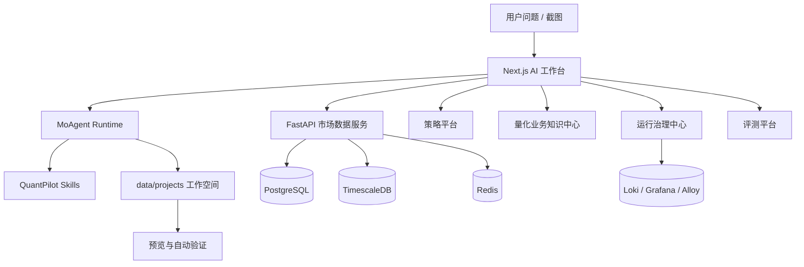

# QuantPilot 文档总览

这个目录保存 QuantPilot 的项目知识，也是唯一的完整文档索引。根目录 README 负责定位和首次启动；长期配置、架构设计、教学材料、数据口径和排障经验在这里维护，避免再建立内容重复的二级导读。

## 先读哪几篇

第一次进入项目，先读 [配置、模型接入与可选组件指南](configuration.md) 选择 ModelPort、DeepSeek 官方直连与 Memory 开关，再按目标进入对应专题。

| 目标 | 文档 |
| --- | --- |
| 不知道从哪篇开始 | 本页下方“按角色阅读”与“知识地图” |
| 想理解 `.env`、选择模型或关闭 Memory | [配置、模型接入与可选组件指南](configuration.md) |
| 想看后续持续完善路线 | [持续完善路线图](ROADMAP.md) |
| 想建立全局学习路线 | [教学 00：项目学习地图](learning/00-project-study-map.md) |
| 想快速跑起来 | [教学 01：本地启动与健康检查](learning/01-quick-start.md) |
| 想配置登录、用户权限或用量配额 | [用户、权限与会话管理](authentication.md) |
| 想接入、使用或验证用户记忆服务 | [用户记忆服务接入、使用与效果验证](user-memory-integration.md) |
| 想接入受治理知识平台 | [Agent Knowledge Platform 接入与解耦边界](knowledge-platform-integration.md) |
| 想理解联合上下文、项目空间隔离或接入后续产品 | [联合上下文、项目隔离与接入规范](context-composition.md) |
| 想配置 DeepSeek 或本地 Qwen 模型 | [模型 Provider 接入与使用](model-providers.md) |
| 想确认当前前端启动模式 | [基础设施配置](infrastructure.md#主前端启动器) / [架构总览](architecture.md#构建与开发模式) |
| 想理解生成链路 | [教学 02：AI 工作空间生成链路](learning/02-ai-workspace-generation.md) |
| 想理解或扩展自研 Agent | [MoAgent 架构](moagent.md) |
| 想把 Data Agent 接入新业务系统 | [Data Agent 平台与 Domain Pack 架构](data-agent-architecture.md) |
| 想理解数据和策略平台 | [教学 03：市场数据与策略平台](learning/03-market-data-and-strategy-platform.md) |
| 想优化生成页面 | [教学 04：Skills 与可视化看板](learning/04-skills-and-visual-dashboard.md) |
| 想做评测和运维 | [教学 05：评测、运维与质量门](learning/05-evaluation-and-operations.md) |
| 想查页面和后端接口 | [API 总览](api-reference.md) |
| 想查数据库字段口径 | [数据字典](data-dictionary.md) |
| 想执行补数、验证或排障流程 | [运行手册](operations-runbook.md) |
| 想备份、清理 E2E/过期数据或判断哪些数据必须保留 | [数据生命周期与安全清理](data-lifecycle.md) |
| 想做生产发布、备份恢复或回滚 | [生产发布 Runbook](release-runbook.md) |
| 想做每日投研报告和推送 | [投研情报中心与日报自动化指南](research-automation-guide.md) |
| 想参与开发 | [教学 06：开发者协作手册](learning/06-developer-playbook.md) |
| 想学习怎么写 Skills | [教学 07：Skills 编写与迭代教程](learning/07-skills-authoring.md) |
| 想深入策略平台 | [策略平台使用与设计指南](strategy-platform-guide.md) |
| 想深入运行治理中心 | [运行治理中心使用与评分指南](ops-platform-guide.md) |
| 想优化后端能力边界 | [后端能力架构与持续优化边界](backend-capability-architecture.md) |

## 按角色阅读

| 你现在要做什么 | 先读 | 然后读 |
| --- | --- | --- |
| 只想把项目跑起来 | [配置指南](configuration.md)、[本地启动与健康检查](learning/01-quick-start.md) | [故障排查](troubleshooting.md) |
| 第一次接手项目 | [项目学习地图](learning/00-project-study-map.md) | [项目结构](project-structure.md)、[内部组件](internal-components.md) |
| 改前端页面 | [项目结构](project-structure.md) | [模块边界](module-boundaries.md)、对应页面专题 |
| 改市场数据后端 | [后端能力架构](backend-capability-architecture.md) | [API](api-reference.md)、[数据字典](data-dictionary.md)、[行情数据源](market-data-source-knowledge.md) |
| 处理生成页面质量 | [AI 工作空间生成链路](learning/02-ai-workspace-generation.md) | [Skills 与可视化看板](learning/04-skills-and-visual-dashboard.md)、[工作空间契约](generated-workspace-contract.md) |
| 做策略平台或股票数据 | [市场数据与策略平台](learning/03-market-data-and-strategy-platform.md) | [策略平台指南](strategy-platform-guide.md)、[数据字典](data-dictionary.md) |
| 配模型或 Query Rewrite | [配置指南](configuration.md) | [模型 Provider](model-providers.md)、[MoAgent](moagent.md) |
| 接入或关闭用户记忆 | [配置指南](configuration.md#memory-接入方式) | [Memory 专题](user-memory-integration.md) |
| 做评测与发布 | [评测、运维与质量门](learning/05-evaluation-and-operations.md) | [评测指南](evals-guide.md)、[生产发布](release-runbook.md) |
| 写或改 Skill | [Skills 教程](learning/07-skills-authoring.md) | [Skills 治理](skills-governance.md) |

想在 30 分钟内建立全局认识，依次读项目学习地图、本地启动、项目结构和模块边界；要开始参与开发，再补开发者协作手册、内部组件、API 总览和运行手册。排障时不要从头读，根据现象直接进入故障排查及对应专题。

## 知识地图

| 模块 | 文档 | 关注点 |
| --- | --- | --- |
| 配置与运行方式 | [配置、模型接入与可选组件指南](configuration.md) | 文件优先级、ModelPort/直连、Memory 开关、secret 边界与模式验收 |
| 总体架构 | [架构总览](architecture.md) | 主链路、运行时、数据层、控制台和质量门 |
| Agent 框架 | [MoAgent 架构](moagent.md) | Provider、Context Manager、Run Engine、durable ledger、类型化工具、Skills 与安全边界 |
| Data Agent 与业务扩展 | [Data Agent 平台与 Domain Pack 架构](data-agent-architecture.md) | 通用任务合同、Agent Profile、Domain Pack、工具与 Mission 注入、金融迁移边界 |
| 内部组件 | [内部组件学习指南](internal-components.md) | 页面、服务、数据、Skills、验证、运维和降级如何协作 |
| 项目结构 | [项目结构与分层边界](project-structure.md) | 前端、后端、量化领域层、脚本和生成工作空间边界 |
| 模块边界 | [模块边界与模块化单体治理](module-boundaries.md) | 模块清单、允许依赖、质量门和拆分顺序 |
| 路线图 | [持续完善路线图](ROADMAP.md) | 后续优先级、验收标准和暂不建议事项 |
| 后端能力 | [后端能力架构与持续优化边界](backend-capability-architecture.md) | Python 后端、设计模式、模块落点、ClickHouse 和迁移路线 |
| API | [API 总览](api-reference.md) | Next.js API、market-data API、调用方和排查路径 |
| 数据字典 | [数据字典](data-dictionary.md) | Prisma 表、quant schema、字段来源、因子和数据质量口径 |
| 基础设施 | [基础设施配置](infrastructure.md) | PostgreSQL、TimescaleDB、Redis、Loki/Grafana/Alloy、SQL 初始化和降级模式 |
| 认证与访问治理 | [用户、权限与会话管理](authentication.md) | 用户生命周期、capability 与项目角色双层授权、用量配额、数据库会话、安全审计和页面/API/WebSocket 边界 |
| 用户记忆 | [用户记忆服务接入、使用与效果验证](user-memory-integration.md) | 启动接入、HTTP 解耦、实际效果、个性化键、归因反馈、鉴权与降级 |
| 受治理知识 | [Agent Knowledge Platform 接入与解耦边界](knowledge-platform-integration.md) | AKEP ContextPack、Citation/Usage、OAuth、降级与 ModelPort 分工 |
| 联合上下文 | [Memory、Knowledge 与 QuantPilot 联合上下文](context-composition.md) | Consumer/Workspace 两层隔离、后续产品接入、Usage Receipt、ContextUseManifest 与结果回流 |
| 模型 Provider | [模型 Provider 接入与使用](model-providers.md) | DeepSeek、本地 Qwen、凭据、模型选择、协议要求与排障 |
| 行情数据 | [行情数据源采集知识库](market-data-source-knowledge.md) | 东方财富、Baostock、AKShare、字段口径和补数规则 |
| 策略平台 | [策略平台使用与设计指南](strategy-platform-guide.md) | 股票池、ETF/指数池、策略目录、因子目录、补数控制和策略数据依赖 |
| 投研情报中心 | [投研情报中心与日报自动化指南](research-automation-guide.md) | 观察池、证据采样、报告库、主题洞察和自动化交付 |
| 运行治理中心 | [运行治理中心使用与评分指南](ops-platform-guide.md) | 工作空间健康、治理评分、日志、降级模式和排查路径 |
| Runbook | [运行手册](operations-runbook.md) | 长任务、补数、缓存、验证、skills 和提交前质量门 |
| 生产发布 | [生产发布 Runbook](release-runbook.md) | 生产预检、独立产物、readiness、备份恢复、回滚和 GA 签字 |
| 数据生命周期 | [数据生命周期与安全清理](data-lifecycle.md) | 数据所有权、测试隔离、备份、跨平台清理和禁止事项 |
| 工作空间契约 | [生成工作空间契约](generated-workspace-contract.md) | run plan、数据文件、证据、验证、视觉检查和修复计划 |
| Skills | [Skills 治理规范](skills-governance.md) / [Skills 教程](learning/07-skills-authoring.md) | skill 元数据、版本、发布、回滚、锁文件和编写方法 |
| 评测 | [Agent 评测指南](evals-guide.md) | 用例、评测集、评测器、队列、运行记录和 CI 门禁 |
| 本地产物 | [本地产物与生成文件边界](local-generated-files.md) | 哪些文件可提交、哪些文件只保留本地 |
| 排障 | [故障排查](troubleshooting.md) | 端口、数据库、生成工作空间、验证和常见失败 |
| 市场数据服务 | [市场数据服务 README](../services/market-data/README.md) | FastAPI 接口、provider、补数端点和后端开发 |
| 文档写作 | [文档写作风格指南](documentation-style-guide.md) | 如何写得准确、可读、少一点机器味 |

## 当前能力分层

AI 工作台的最终回复会附带完整业务回合耗时与累计 Token 用量；统计覆盖主 MoAgent run 和自动修复 run，并保存在消息 metadata 中，因此刷新或实时通道重连后仍可恢复，同时不会进入下一轮模型上下文。详细口径见 [MoAgent 架构](moagent.md#回合耗时与-token-口径)。

## 文档维护规则

- README 只保留定位、启动和导航；复杂知识放到 `docs/`。
- 业务规则先写到对应专题文档，再在教学文档里用步骤串起来。
- 写文档时先讲人能理解的背景，再放命令、表格和路径。不要只堆能力名。
- 修改代码后如果改变了使用方式、排障方式或模块边界，必须同步文档。
- 改启动脚本、端口池、缓存策略或 bundler 相关依赖时，至少同步 README、`learning/01-quick-start.md`、`infrastructure.md`、`operations-runbook.md` 和 `troubleshooting.md`。
- 页面截图放在 `docs/learning/assets/`，命名使用页面或流程含义，例如 `strategy-platform.png`。
- 截图前需要确认页面没有 Next 错误覆盖层、验证失败页、明显横向溢出或加载空白。
- 真实密钥、个人路径、未脱敏日志不要写入文档。
- `data/`、`tmp/`、`.next/`、虚拟环境和生成项目大产物不进入 Git。
