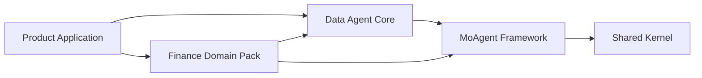

# Data Agent 平台与 Domain Pack 架构

QuantPilot 采用可复用的数据智能平台架构：MoAgent 提供执行框架，Data Agent 提供通用数据任务合同，不同业务通过 Domain Pack 注入实体、数据源、Skills、工具、验证和可视化规则。金融量化是第一个完整 Domain Pack，而不是通用内核的默认假设。

这次调整的目标不是把 QuantPilot 改成抽象框架展示项目，而是建立一条可持续扩展的产品主线：

```text
Data Agent 产品
  = MoAgent Framework
  + Data Agent Core
  + 一个或多个 Domain Pack
  + Delivery Pack
  + 可选 Memory / Knowledge Policy
```

## 分层与责任

| 层 | 负责什么 | 不负责什么 | 当前入口 |
| --- | --- | --- | --- |
| MoAgent Framework | Provider、Agent loop、上下文预算、类型化工具、Skill 编译、Mission 执行与证据验证机制 | 证券、K 线、财报等业务概念 | `src/lib/agent/**` |
| Data Agent Core | 通用任务、实体、指标、维度、数据集、Connector、Domain Pack、Agent Profile、组合锁、应用 Catalog 和执行计划合同 | 某个行业的解析规则和接口地址 | `src/lib/data-agent/**` |
| Finance Domain Pack | 证券实体、行情连接器、量化能力、金融 Skills、金融工具、Mission、验证和可视化配置 | 通用 Agent loop 和跨行业任务模型 | `src/lib/domains/finance/**` |
| QuantPilot Application | 项目、聊天、预取、工作空间交付和金融产品页面 | 定义新的通用 Agent 机制或领域合同 | `src/lib/quant/**`、`src/lib/services/**`、`src/app/**` |
| Delivery Pack | 把结果交付为 dashboard、report、dataset 或其他受验证产物 | 解释领域语义 | `src/lib/data-agent/delivery-packs/**` |

依赖方向必须保持为：



`src/lib/agent/**` 不得导入 `src/lib/data-agent/**`、`src/lib/domains/**` 或 `src/lib/quant/**`；Data Agent Core 不得导入具体 Domain Pack；Finance Domain Pack 不得反向依赖 `quant` 产品编排层。规则由 `config/module-boundaries.json` 和 `npm run check:module-boundaries` 固化。

## 三类核心合同

### DataAgentTask

`DataAgentTask` 是 LLM-first Query Rewrite 的通用输出。它表达目标、实体提及、已核验实体、指标、维度、筛选、时间范围、输出类型和需要澄清的问题。

语义理解必须来自项目选中的大模型。Resolver 只在模型改写后核验实体身份，例如把“大位科技”确认成标准证券代码；不能用关键词、正则或路由表替代语义理解。模型不可用或合同不合格时应失败关闭，不把启发式结果伪装成成功。

### Domain Pack

`DataAgentDomainPack` 是一个版本化业务能力包，至少声明：

- capabilities：用户可选择的业务能力；
- resolvers：实体身份核验器；
- connectors：只读或外部写入操作及输入输出 schema；
- skillIds：模型执行所需的业务知识；
- toolNames：运行时可以暴露的领域工具；
- validatorIds：交付前必须执行的领域检查；
- visualizationProfileIds：业务适用的表达和可视化配置。

当前金融实现位于 `src/lib/domains/finance/agent-profile.ts`，标识为 `finance.quant@1.0.0`。

### Agent Profile

`DataAgentProfile` 不是模型名称，而是一套可部署的 Agent 组合。它选择 Domain Pack、默认 capability、Delivery Pack，以及可选的 Memory/Knowledge policy。

当前 `quantpilot.finance-research@1.0.0` 组合：

```text
MoAgent
  + finance.quant
  + workspace.next-dashboard
  + quantpilot.personalization（可选）
  + quantpilot.governed-knowledge（可选）
```

项目表的 `agent_profile_id`、`agent_profile_version` 和 `data_agent_composition_sha256` 是选择事实源，项目空间的 `.data-agent/workspace.json`、`profile.json` 是可审计运行投影；两者不能依赖进程内隐式默认值。`POST /api/projects` 只接受通用 `agentProfileId`、`capabilityId` 和 `capabilitySelectionSource`，未知 Profile/capability 在写目录和入库前失败关闭。

`workspace.next-dashboard@1.0.0` 已作为独立 Delivery Pack 注册，声明支持的输出、工作区目录、权威产物路径和通用 validator。Finance Domain Pack 不再自行发明目录结构；应用 composition root 组合 Delivery Pack、Finance Domain Pack 与 Agent Profile。

`DataAgentRegistry.resolveCapability()` 会同时校验 capability 已注册、状态为 `ready`、输出被 capability 与 Delivery Pack 共同支持，并生成不可变 `DataAgentCompositionLock`。锁包含 Profile、所有 Domain Pack、Delivery Pack、capability 的 ID/版本和内容 SHA-256；项目、workspace、run plan、Mission 与 generation envelope 使用同一身份。

`DataAgentApplicationCatalog` 把 Profile 绑定到项目 provision adapter。通用项目服务不再创建金融 run plan 或安装金融 Skill，而是调用选中 Profile 的 adapter。当前 Finance adapter 位于 `src/lib/quant/data-agent-application.ts`；新增业务通过注册 adapter 扩展，不在 `project.ts` 增加行业分支。

### Generation Envelope 与领域 Handler

HTTP 请求把规划、数据准备和 Mission 创建委托给 Domain 应用服务，完成后会先把 schema v3 `DataAgentGenerationEnvelope` 写入 PostgreSQL job/outbox，再向客户端返回已排队。信封包含不可变 composition lock、Consumer/Tenant/Project/Workspace/Request scope、跨平台 `integrationScopeSha256`、Provider-neutral 执行输入和本次已准备的 Memory/Knowledge 快照，不保存 API Key、Authorization、Cookie、Provider 私有 session 或 hidden reasoning。

生产 generation worker 与本地 inline 调度都根据 `composition.profile.id` 从 `DataAgentGenerationRuntimeRegistry` 解析同一个 handler。Worker 执行前重新核对 envelope 自身哈希、项目 Profile 版本/组合哈希、job 的 Project/Request、canonical workspace 和当前 integration scope；任何漂移都失败关闭。当前 composition root 只注册 `quantpilot.finance-research` handler，但 Worker、dispatch、lease、heartbeat、attempt 和 fencing 都位于通用执行边界。新增业务必须注册自己的 Profile handler，不能在 Worker 脚本里增加行业判断分支。

```text
Web: Task -> Domain Plan -> Data Prefetch -> Mission -> durable job/outbox
                                                        |
Worker/inline: registry -> domain handler -> MoAgent -> Delivery validation -> receipt
```

## 工作空间合同

工作空间采用“通用控制合同 + 领域合同 + 业务数据/证据”三层结构：

```text
.data-agent/
  workspace.json     # 项目身份与 MoAgent 运行时选择
  profile.json       # Agent Profile 与当前 capability
  task.json          # 通用 DataAgentTask
  plan.json          # 通用 DataAgentExecutionPlan
  finance-query-rewrite.json # 金融 schema v4 领域合同
  finance-run-plan.json      # 金融取数和可视化计划
  validation.json    # 当前金融 Delivery Pack 验证报告
data_file/final/
  dashboard-data.json
evidence/
  sources.json
  data_quality.json
```

`.data-agent/**` 是唯一工作空间控制面。通用消费者读取 `workspace/profile/task/plan`，Finance Domain Pack 读取带 `finance-` 前缀的领域扩展；运行状态、验证和证据投影也只写入该目录。平台不会探测或读取任何旧控制目录。

Agent 工具不能修改这个控制目录；它只能由平台编排器写入。控制 JSON 使用同目录临时文件加 rename 原子提交，并拒绝嵌套 symlink 逃逸。Mission 会把 `.data-agent/workspace.json`、`profile.json`、`task.json` 和 `plan.json` 纳入冻结 subject manifest，防止验证期间任务身份漂移。

图片附件也遵循这条边界。`src/lib/data-agent/image-attachments.ts` 只负责项目相对路径校验、真实图片签名/大小校验、安全公共镜像和通用 `.data-agent/attachments.json`；它不知道持仓、证券或量化工具。`src/lib/domains/finance/image-attachment-context.ts` 才注入持仓字段、证券 Resolver、`quant_extract_uploaded_image` 和金融证据要求。未来零售、运营或制造 Domain Pack 可复用通用附件层，并写自己的领域扩展，不需要复制聊天入口。

## 运行组合

一次金融任务目前按下面顺序运行：

1. 产品层根据项目选择加载 Agent Profile。
2. 选中的 LLM 生成金融 Query Rewrite，Resolver 独立核验证券实体。
3. Finance Domain Pack 投影出 `DataAgentTask`，并形成金融 run plan 与通用 execution plan。
4. Finance Domain Pack 提供 capability 到 Skill descriptor 的投影。
5. Finance 工具工厂组合通用文件工具、金融行情工具、看板编译器和检查器。
6. Finance Mission Definition 声明所需产物、节点、预算、验证和接受条件。
7. Web 把严格版本化的 Finance generation envelope 与 job/outbox 原子持久化；生产模式由独立 Worker claim。
8. 通用运行时注册表把任务分派给 Finance handler，MoAgent 只消费注入后的 Skills、Tools 与 Mission，不认识任何证券或量化类型。
9. Delivery 验证通过且证据 receipt 被接受后，任务才进入 completed。

Skills 编译器只支持通用的 `activatedSkillIds` 与 `excludedSkillIds`。例如“有附件时启用图片提取”“证券已经解析后排除 symbol resolver”均由金融调用方决定，MoAgent 内核不硬编码这些 ID。`query_json` 的 artifact handles、alias、identity 校验、对象字段优先级和领域提示也由 `MoAgentJsonArtifactConfiguration` 注入；Finance 配置位于 `src/lib/domains/finance/agent-tools/structured-read.ts`。

## 项目空间创建与删除

项目空间只允许位于 `PROJECTS_DIR/<projectId>`，数据库 `repoPath` 是 canonical path 的身份断言，不是任意文件系统权限。创建流程为：

1. 校验 Profile/capability/组合和 canonical target，拒绝已有目录；
2. 先写入 `status=initializing` 的项目事实；
3. 在 `PROJECTS_DIR` 下创建隔离 staging，由 Profile Adapter 完成全部 provision；
4. staging 通过后 rename 为最终目录，再把项目置为 `idle`；
5. 任一步失败都删除 staging、已提交目录和 initializing 行。

这保证重复 project ID 不会覆盖已有 `.data-agent`，用户也不会看到一个被标记为可用但只写了一半的 workspace。删除前先验证数据库 `repoPath` 与 canonical path 一致并拒绝 symlink；验证通过后才提交数据库删除和目录清理。

## 开发新的 Domain Pack

建议以 `src/lib/domains/<domain>/` 为根目录，按下面顺序实现。

### 1. 定义领域和实体

先确定领域 ID、实体类型和稳定 canonical ID，例如：

```text
domainPackId: retail.operations
entityType: retail.store
canonicalId: store-310102-001
```

实体 Resolver 必须返回来源、置信度和可审计属性。不要把显示名称当主键，也不要让模糊实体直接进入取数。

### 2. 注册 Connector

每个操作声明稳定 ID、effect、输入 schema、输出 schema 和 required scopes。读取与外部写入要明确区分；外部写入默认不得进入通用工具集，必须由 Profile 显式授权并留下 operation receipt。

### 3. 声明 Capability 与 Skills

Capability 描述用户目标，不应等同于某个 API。它将多个 Connector 操作、Skills 和输出形式组合为可验证能力。Skill 负责业务判断和工作流说明，工具负责确定性 I/O；不要在 Skill 内保存凭据或用文字绕过工具权限。

### 4. 提供工具工厂

使用 `createMoAgentTools` 组装通用工具，再通过 Domain Pack 注入领域工具、prepared compiler、inspector 和 receipt projector。工具名必须唯一；修改型工具必须加入 Profile 的允许列表。

金融示例见 `src/lib/domains/finance/agent-tools/factory.ts`。

### 5. 提供 Mission Definition

Mission Definition 必须声明：

- subject、evidence、control 产物及可变性；
- 节点依赖、effect、允许工具和预算；
- validation report 路径和检查 ID；
- acceptance predicates；
- 领域实体引用类型。

MoAgent Mission 编译器只验证这份定义，不内置金融节点或文件名。金融示例见 `src/lib/domains/finance/mission-definition.ts`。

### 6. 注册 Delivery Pack、Profile 并做隔离测试

使用 `DataAgentRegistry` 注册 Delivery Pack、Domain Pack 和 Profile，再用 `DataAgentApplicationCatalog.register()` 注册 provision adapter。Delivery Pack 的目录和产物必须是无 `..`、无反斜杠的工作区相对 POSIX 路径。测试至少覆盖重复 ID、缺失 Domain/Delivery Pack、选中 capability 唯一且 ready、输出兼容性、组合哈希篡改、工具重名、越权修改、实体串空间、路径越界、symlink 和工作空间控制目录只读。

### 7. 接入产品层

产品创建项目时选择 Profile；运行时从持久化选择恢复组合，不从 UI 文案猜领域。Memory、知识库和 ModelPort 都必须使用 Consumer + Tenant + Project + Workspace 作用域，Domain Pack 不能共享数据库表或全局缓存键来绕过隔离。

## 当前实现状态

已经完成：

- 通用 contracts 与 registry；
- 金融 Query Rewrite、Planner、capability、数据身份、可视化、工具和 Mission 定义均位于 Finance Domain Pack；
- MoAgent Skills、Tools、Mission 不再导入量化模块，核心 structured reader 不再保存金融 artifact/path/alias；
- 工作空间只写入 `.data-agent`，并冻结 workspace/profile/task/plan 四份核心合同；
- 图片接入已拆为 Data Agent 通用资产层和 Finance Domain Adapter，Act API 不再接收 base64 或绝对路径；
- schema v3 generation envelope、Profile handler 注册表和独立 Worker 已形成真实运行时分派边界；Finance 不再硬编码在 Worker 主循环；
- PostgreSQL job/outbox、attempt、lease、heartbeat 和 fencing 为权威状态；Worker 崩溃后在预算内指数退避并从持久化合同重新规划；
- 模块边界加入反向依赖、未声明 `dependsOn` 和依赖环门禁。
- `workspace.next-dashboard` 已成为独立、版本化 Delivery Pack；Profile 解析会校验默认 capability 与交付输出兼容。
- Project 已持久化 Profile ID/版本与组合 SHA-256；workspace/profile/run plan/Mission/envelope 携带一致组合锁。
- 项目空间创建采用 initializing + staging + rename + rollback，路径和删除严格限定在 canonical `PROJECTS_DIR`。

后续扩展项：

- 当前 Catalog 只注册金融 Profile 的完整 provision/act/worker adapter；下一个非金融 Domain Pack 需要补齐真实 Connector、handler 和评测集后才能开放通用 Profile 选择 UI。

## 验收清单

提交新的 Domain Pack 或改动框架前，至少执行：

```bash
npm run type-check
npm run check:module-boundaries
npm run check:skills
npm test -- --runInBand
```

重点人工检查：

- 通用内核是否出现领域文件名、工具名或实体类型；
- Domain Pack 是否反向导入产品应用目录；
- Query Rewrite 是否仍由 LLM 完成，而非关键词匹配；
- 工作空间是否写入 Profile、Task、Plan 且项目作用域正确；
- Mission completed 是否仍以验证和 evidence receipt 为准，而非 Agent 自述。
