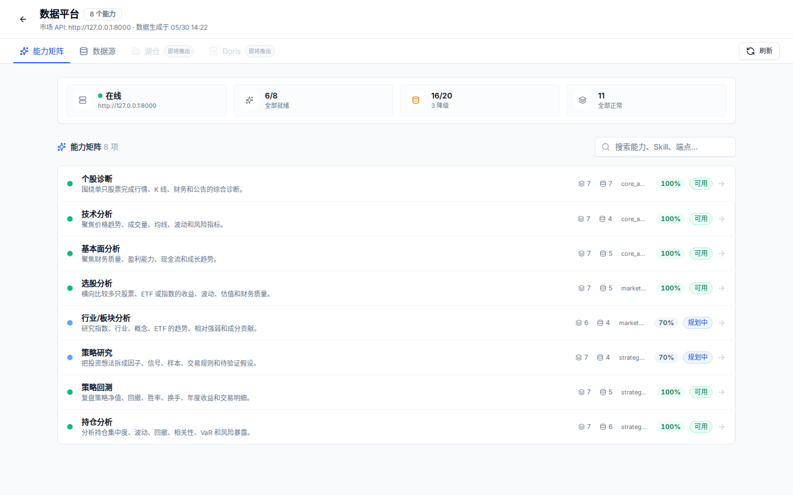

# 06. 开发者协作手册

目标：知道 QuantPilot 的代码该往哪里放、怎么验证、哪些文件不该提交。



## 代码边界

| 路径 | 责任 |
| --- | --- |
| `src/app/` | Next.js App Router 页面和 API 路由 |
| `src/components/` | 可复用前端组件 |
| `src/lib/services/` | 主应用业务服务 |
| `src/lib/quant/` | 量化平台领域逻辑、评测、验证、策略、skills |
| `src/lib/db/` | Prisma Client 和数据库入口 |
| `services/market-data/` | Python/FastAPI 市场数据服务 |
| `prisma/` | PostgreSQL 主业务 schema |
| `sqls/` | PostgreSQL / TimescaleDB 初始化 SQL |
| `scripts/` | 开发、构建、检查、数据库、评测和 skills 脚本 |
| `.claude/skills/` | QuantPilot 核心 skills |
| `docs/` | 项目知识、教学和排障 |
| `data/projects/` | 本地生成工作空间，默认不提交 |

详细边界见 [项目结构与分层边界](../project-structure.md)。

## 分层思维

QuantPilot 不是单纯的前端项目，也不是单纯的数据服务。改代码前先判断这次变更属于哪一层：

| 层级 | 典型问题 | 应该改哪里 |
| --- | --- | --- |
| 页面交互 | 按钮、弹窗、分页、图表展示不合理 | `src/app/*/*Client.tsx` 或 `src/components/` |
| 平台业务 | 项目、消息、设置、评测、策略状态 | `src/lib/services/` 或 `src/lib/quant/` |
| 市场数据 | 行情接口、补数、股票池分页、因子口径 | `services/market-data/` 和 `sqls/` |
| 数据结构 | 新表、新字段、索引、初始化数据 | `prisma/schema.prisma` 或 `sqls/*.sql` |
| 生成能力 | Agent 反复生成不好看的页面或用错数据 | `.claude/skills/` 和评测用例 |
| 运维基础 | 日志、健康检查、降级模式、端口 | `docker-compose.yml`、`deploy/`、`src/lib/ops/` |

分层的意义是降低连带风险。比如股票池页面显示问题不应该直接改数据库表；DDE 字段缺失也不是靠前端写死一个 `0` 解决，而是要先明确数据源和入库口径。

## 开发原则

- 前端页面只做组织和交互，复杂业务逻辑下沉到组件或 `src/lib/*`。
- API route 只做参数解析、校验和服务调用。
- 市场数据写入和读取优先通过 `services/market-data`，生成页面不要直接抓外部网页接口。
- PostgreSQL/TimescaleDB 是事实库，Redis 是短期缓存，不把 Redis 当长期数据源。
- 生成工作空间的问题优先修 skill 和生成链路，不直接手改单个工作空间作为长期方案。
- 文档、SQL 和代码需要同步更新，避免“代码会跑但新同学不知道怎么用”。

## 常见改动路径

### 新增一个策略平台字段

1. 先确认字段来源和口径，例如来自东方财富、Baostock、AKShare 还是本地计算。
2. 如果需要长期保存，先补 `sqls/` 或后端数据库映射。
3. 在 `services/market-data` 返回字段，并保证已有数据不会被空值覆盖。
4. 在 `src/lib/quant/strategy-mappers.ts` 做类型映射，并补充 mapper 单元测试。
5. 在策略平台客户端展示，避免重复列和低价值指标。
6. 更新 `docs/learning/03-market-data-and-strategy-platform.md` 和相关 README。

### 新增一个基础设施组件

1. 先判断它是不是必需组件，是否需要降级模式。
2. 更新 `docker-compose.yml` 和 `.env.example`。
3. 在 `scripts/checks/doctor.js` 和运行治理中心增加健康检查。
4. 写入 `docs/infrastructure.md`、`docs/troubleshooting.md` 和 README。
5. 确认没有和主前端、预览端口或数据库端口冲突。

### 修一个生成页面反复不好看的问题

1. 找到具体失败截图或验证报告。
2. 判断是数据不足、模板错配、布局问题还是 skill 缺规则。
3. 如果是单次生成错误，修当前工作空间；如果是系统性错误，修 skill。
4. 给评测或视觉 smoke 增加覆盖，防止回归。

## 提交前检查

```bash
npm run release:check
```

正式发布使用 `npm run release:check:full`，它会额外运行完整依赖审计和运行态基础设施诊断。

涉及数据库：

```bash
npm run db:init
npm run db:doctor
```

涉及后端：

```bash
cd services/market-data
uv run ruff check .
uv run pytest
```

涉及截图或页面：

```bash
npm run check:homepage
npm run check:platform-visuals
```

`check:platform-visuals` 会覆盖全部主入口的桌面亮色、移动端暗色、横向溢出、浏览器运行错误和历史路由重定向；聊天页使用只读视觉模式，不会启动依赖安装或自动重验。必要时再查看 `tmp/visual-checks/platforms/` 中的截图人工复核。

## 不应提交的内容

- `.env`、`.env.local`
- `.next/`
- `node_modules/`
- `data/`
- `tmp/`
- `public/uploads/`
- `public/generated/`
- `services/market-data/.venv/`
- `services/**/.ruff_cache/`
- 真实 token、个人路径、未脱敏日志

## 推荐补充文档的位置

| 新知识 | 推荐位置 |
| --- | --- |
| 新组件、新端口、新环境变量 | `docs/infrastructure.md` |
| 新表、新字段、新 SQL | `sqls/README.md` 和相关专题文档 |
| 新行情源、新字段口径 | `docs/market-data-source-knowledge.md` |
| 生成工作空间文件变化 | `docs/generated-workspace-contract.md` |
| 新 skill 或版本治理规则 | `docs/skills-governance.md` |
| 新评测规则 | `docs/evals-guide.md` |
| 新人教程 | `docs/learning/` |

`docs/learning/` 的写法要偏教学：不要只写“运行这个命令”，还要解释这个命令背后的组件、为什么需要它、失败时意味着什么。README 可以短，learning 应该帮助读者建立模型。

## 调试口诀

1. 先看页面是否能打开。
2. 再看 API 是否返回。
3. 再看数据库是否有数据。
4. 再看 skill 是否把数据正确用进页面。
5. 最后看验证报告和截图，确认问题是数据、代码、布局还是契约。
