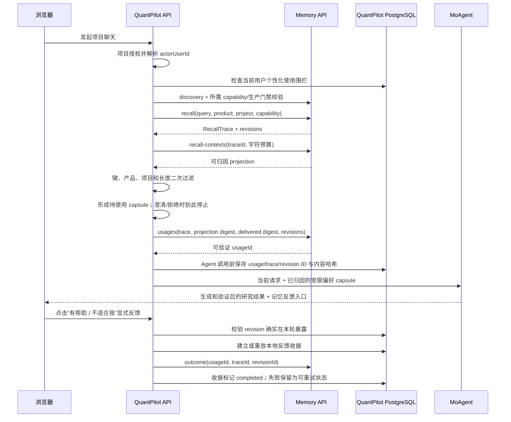

# 用户记忆服务接入、使用与效果验证

这篇文档说明如何把独立项目 `evolvable-user-memory` 接入 QuantPilot，以及接入后怎样写入偏好、验证聊天是否使用了记忆、提交可归因反馈和排查常见故障。

读完后，你应该能够：

- 启动 Memory 服务并确认它公布了 QuantPilot 需要的版本化契约。
- 配置 QuantPilot、部署本地归因表并让 readiness 变绿。
- 写入一条全局或项目级偏好，在下一轮聊天中验证 `prepared → 实际归因 → Outcome` 效果。
- 理解“记住偏好”和“改变系统规则”的边界，避免把行情、权限或交易指令写成记忆。

## 当前接入形态

QuantPilot 当前把 Memory 作为可选外部服务使用。聊天执行、项目 API 和账号级使用控制已经接通；用户可在 `/account/memory` 明确启用或暂停未来任务的个性化。

| 能力 | 当前入口 | 行为 |
| --- | --- | --- |
| 用户使用控制 | QuantPilot `/account/memory` | 未明确启用时不向 Memory 发起任务召回；变更写入本地审计 |
| 显式新增偏好 | 项目对话输入区“记住偏好”/ QuantPilot 项目级 Memory API | 用户确认后创建证据、候选和第一条不可变 revision；不自动保存聊天全文 |
| 候选偏好确认 | 用户消息下方候选卡 | 只在高置信稳定表达时提示；交易、授权和一次性要求被过滤；不自动写入 |
| 查看与纠正偏好 | `/account/memory` 或 QuantPilot Memory API | 查看当前值、追加修订、保留历史版本 |
| 聊天自动召回 | `/api/chat/:projectId/act` | 每轮执行前召回，并把通过过滤的有界 capsule 交给 MoAgent |
| 使用归因 | Memory `/v1/usages` + QuantPilot PostgreSQL `external_memory_uses` | Memory 重建投影并签发 Usage Receipt；QuantPilot 只保存 usage/trace/revision 不透明 ID、策略版本和内容哈希 |
| 结果反馈 | 已验证完成消息下方“有帮助 / 不适合我” | UI 先读取 QuantPilot 本地归因；持久收据保证重试幂等并拒绝矛盾反馈 |
| 价值透明度 | `/account/memory`“实际价值闭环” | 只统计真正交给 Agent 的 revision 和明确反馈；旧版空归因单独隔离 |
| 可视化管理 | Memory 自带工作台 `http://127.0.0.1:33009` | 用于理解和调试 Memory 自身，不代替 QuantPilot 项目授权 |

管理 QuantPilot 用户偏好时应调用 QuantPilot API，不要让浏览器绕过 QuantPilot 直接调用 Memory。这样项目权限、可信用户身份、键白名单和归因账本才不会被跳过。

## 可以不启用 Memory

Memory 是可选组件，不是模型调用、行情读取或 workspace 生成的前置条件。如果当前不需要个性化、还没有部署 Memory，或希望先独立验收 QuantPilot 与 ModelPort，只需设置：

```dotenv
QUANTPILOT_MEMORY_ENABLED=0
```

关闭后 QuantPilot 不发起 Memory discovery、recall 或 outcome 请求，不需要 `QUANTPILOT_MEMORY_API_URL`、Bearer Token 或 Token Broker。聊天个性化状态为 `disabled`，账号记忆管理、偏好召回和本轮偏好反馈不可用；模型、LLM Query Rewrite、市场数据、工作空间生成、自动验证和预览继续正常工作。

不要用下面两种配置表达“关闭”：

```dotenv
# 仍会使用 Memory，只是在故障时允许核心任务继续
QUANTPILOT_MEMORY_ENABLED=1
QUANTPILOT_MEMORY_REQUIRED=0

# 会同时绕过多项可选外部组件，不只是 Memory
QUANTPILOT_DEGRADATION_MODE=offline
```

模型 Provider 与 Memory 可以任意组合；例如官方 DeepSeek 直连并不要求启用 Memory。完整组合表见 [配置、模型接入与可选组件指南](configuration.md#memory-接入方式)。

## 接入后能看到什么效果

假设用户显式保存了下面的偏好：

```json
{
  "key": "output.answer_style",
  "value": "先给结论，再列风险和证据"
}
```

下一轮同一用户发起研究任务时，QuantPilot 会用当前问题、产品、项目和能力上下文召回记忆。匹配成功并完成二次过滤后，聊天消息 metadata 会先记录“待使用”：

```json
{
  "personalization": {
    "status": "prepared",
    "exposedMemoryCount": 1
  }
}
```

`prepared` 只表示生成了候选 capsule，不证明 Agent 已使用。QuantPilot 仅在把 capsule 交给 MoAgent 前请求 Memory `/v1/usages`；Memory 从不可变 Trace 重建相同算法和预算的投影，核对源摘要及 revision 子集后签发 `usageId`。QuantPilot 随后保存本地归因与[联合上下文清单](context-composition.md)。澄清、拒绝、平台直接生成或用户临时关闭个性化时不会写“已暴露”记录。已验证完成的回复只有查到这份归因后，才显示“本轮实际使用了 N 条个人偏好”及反馈按钮。

MoAgent 收到的是受限 JSON 偏好数据，不是更高优先级指令。可以预期生成结果更倾向于“先结论、再风险和证据”，但当前用户请求、真实金融数据、安全规则和验证合同仍然优先。

| 场景 | 可观察结果 |
| --- | --- |
| 没有匹配偏好 | `personalization.status=empty`，Agent 不注入记忆 capsule |
| 找到候选偏好 | `status=prepared`，`exposedMemoryCount>0`；此时尚不能提交 Outcome |
| 候选偏好真正交给 Agent | QuantPilot 写入本轮 revision 归因；最终回复显示反馈入口 |
| Memory 网络或契约异常，且 `REQUIRED=0` | `status=unavailable`，核心研究任务继续执行 |
| Memory 被关闭 | `status=disabled`，不发起外部召回 |
| 用户未启用或已经暂停 | `status=opted_out`，不联系 Memory，不生成归因账本 |
| 项目级偏好用于其他项目 | 被 QuantPilot 二次过滤，不进入 Agent |
| 用户纠正旧偏好 | 新 revision 生效，旧 revision 仍可在历史中审计 |
| 只反复读取或召回 | 不增加信念或效用；只有可归因 Outcome 才更新上下文效用 |

## 架构和数据边界



必须长期保持以下边界：

- 两个项目独立构建、部署和存储，不共享数据库，也不互相导入内部包或持久化模型。
- Memory 拥有 Evidence、Belief、RecallTrace、Outcome 和检索策略状态；QuantPilot 拥有用户、项目、聊天和授权入口。
- tenant 和 subject 由 QuantPilot 服务端生成。生产环境不能把浏览器请求体中的 tenant/subject 当作授权证明。
- 原始记忆正文不写入 QuantPilot 聊天 metadata；本地只保留归因所需的不透明 ID 和哈希。
- 记忆 capsule 是不可信偏好数据，不能覆盖当前请求、金融事实、权限、安全策略、工具合同、验证或风险控制。
- `PersonalMemoryControl` 只是 QuantPilot 的产品使用围栏，不是法律处理依据，也不代替 Memory 的 ProcessingGrant、抑制与删除编排。治理级删除必须由可信角色通过版本化契约执行，普通账号页面不能借此越权。

## 第一步：启动 Evolvable User Memory

下面假设两个仓库位于同一父目录。若目录布局不同，设置成实际仓库位置即可：

```bash
MEMORY_REPO="../evolvable-user-memory"
```

### 推荐：Compose 持久化模式

该模式会启动 PostgreSQL、Milvus、迁移任务、投影 worker、Memory API 和自带工作台，适合验证真实集成。权威记忆和 append-only 授权审计默认持久化；隐私治理保持开发旁路，只有建立 ProcessingGrant 发放流程后才应显式切换为 `postgres`：

```bash
cd "$MEMORY_REPO"
docker compose up --build -d
docker compose ps
```

默认入口：

| 入口 | 地址 |
| --- | --- |
| Memory API | `http://127.0.0.1:38089` |
| Memory 工作台 | `http://127.0.0.1:33009` |
| OpenAPI | `http://127.0.0.1:38089/docs` |
| 依赖就绪 | `http://127.0.0.1:38089/readyz` |

停止但保留数据使用 `docker compose down`。只有明确要清除本地 Memory 数据时才执行带 volume 删除的操作。

### 轻量：进程内开发模式

只想快速验证 HTTP 链路时，可以不启动容器：

```bash
cd "$MEMORY_REPO"
uv sync
uv run evolvable-memory
```

这个模式默认使用进程内存，后端重启后数据会清空，不适合作为持久化验收环境。Memory 工作台是另一个进程，需要时运行 `uv run evolvable-memory-frontend`。

### 验证版本化契约

QuantPilot 不根据应用版本号猜测能力，而是读取服务根路径的 `api_contract` 和 `capabilities`：

```bash
curl -fsS http://127.0.0.1:38089/
curl -fsS http://127.0.0.1:38089/readyz
```

根路径至少应包含：

```json
{
  "api_contract": "evolvable-memory-http/v1",
  "capabilities": [
    "preference.write",
    "preference.list",
    "preference.correct",
    "preference.history",
    "recall.trace",
    "recall.bitemporal",
    "recall.context-projection",
    "experience.usage-receipt",
    "experience.outcome"
  ],
  "production_ready": false,
  "production_blockers": [
    "configuration.persistent-governance",
    "configuration.trusted-jwt",
    "runtime.production-profile"
  ]
}
```

`/readyz` 应返回 `status=ready`，但它只表示当前依赖可服务；在 JWT 模式下它还会真实读取有界缓存中的 JWKS，URL 不可达或没有签名键时返回 `503`。生产消费者还必须检查 `production_ready` 和机器可读的 `production_blockers`。如果根路径缺少契约字段，通常是旧进程或旧容器仍在运行。

## 第二步：配置 QuantPilot

在 QuantPilot 的 `.env.local` 配置：

```dotenv
QUANTPILOT_MEMORY_ENABLED=1
QUANTPILOT_MEMORY_REQUIRED=0
QUANTPILOT_MEMORY_REQUIRE_PRODUCTION_READY=0
QUANTPILOT_MEMORY_API_URL=http://127.0.0.1:38089
QUANTPILOT_MEMORY_TENANT_ID=quantpilot-local
QUANTPILOT_MEMORY_TIMEOUT_MS=5000
QUANTPILOT_MEMORY_RECALL_LIMIT=6
QUANTPILOT_MEMORY_MAX_CONTEXT_CHARACTERS=2000
QUANTPILOT_MEMORY_BEARER_TOKEN=
QUANTPILOT_MEMORY_TOKEN_BROKER_URL=
QUANTPILOT_MEMORY_TOKEN_BROKER_CLIENT_ID=
QUANTPILOT_MEMORY_TOKEN_BROKER_CLIENT_SECRET=
QUANTPILOT_MEMORY_TOKEN_AUDIENCE=evolvable-memory-api
```

| 变量 | 建议与含义 |
| --- | --- |
| `QUANTPILOT_MEMORY_ENABLED` | `1` 启用；`offline` 降级模式会覆盖并禁用外部集成 |
| `QUANTPILOT_MEMORY_REQUIRED` | 本地推荐 `0`；召回失败时继续核心任务。只有业务明确要求 fail-closed 时才设为 `1` |
| `QUANTPILOT_MEMORY_REQUIRE_PRODUCTION_READY` | 生产默认开启；拒绝连接仍有隐私、身份或审计阻塞项的实例 |
| `QUANTPILOT_MEMORY_API_URL` | HTTP(S) 服务根地址，不允许在 URL 中嵌入凭据 |
| `QUANTPILOT_MEMORY_TENANT_ID` | QuantPilot 这一消费应用独占的稳定 tenant，最长 128 字符；其他产品不得复用 |
| `QUANTPILOT_MEMORY_TIMEOUT_MS` | 单次外部请求超时，范围 100–30000 ms |
| `QUANTPILOT_MEMORY_RECALL_LIMIT` | 单轮最多召回条数，范围 1–100 |
| `QUANTPILOT_MEMORY_MAX_CONTEXT_CHARACTERS` | 进入 Agent 前的 projection 字符预算 |
| `QUANTPILOT_MEMORY_BEARER_TOKEN` | 只用于本地或单 subject 调试；多用户生产静态 token 会被配置校验拒绝 |
| `QUANTPILOT_MEMORY_TOKEN_BROKER_*` | 生产身份服务入口和客户端凭据；按 tenant/subject/purpose 换取 60–3600 秒短期 token |
| `QUANTPILOT_MEMORY_PRODUCTION_PROBE_SUBJECT_ID` | 非人类生产探针 subject；必须有有效 `personalization` ProcessingGrant，仅用于真实授权读路径门禁 |
| `QUANTPILOT_MEMORY_TOKEN_AUDIENCE` | Memory JWT audience，必须与 Memory 的 `EMF_AUTH_JWT_AUDIENCE` 一致 |

部署 QuantPilot 本地归因表，然后重启 Web 进程使环境变量生效：

```bash
npm run prisma:deploy
npm run dev
```

不要让两个项目共用 PostgreSQL。`ExternalMemoryUse` 不是 Memory 数据副本，只是 QuantPilot 对“这一轮到底使用了哪些 revision”的本地审计账本。

## 第三步：确认接入成功

```bash
curl -fsS http://127.0.0.1:3000/api/ready
npm run doctor
```

成功标准：

- `/api/ready` 中 `memory.status=ok`。
- `doctor` 显示 `外部 Memory: discovery / readyz / evolvable-memory-http/v1 通过`。
- PostgreSQL 已存在 `external_memory_uses` 表。
- QuantPilot 日志中没有 `INCOMPATIBLE_CONTRACT`、`NETWORK_ERROR` 或 `TIMEOUT`。

Memory 是 optional 时，`/api/ready` 总体仍可能返回 `ok=true`，所以不能只看顶层状态，必须同时看 `components[].name=memory`。

## 第四步：用户明确启用

登录 QuantPilot 后打开 `/account/memory`，点击“启用个性化”。未配置记录默认关闭；聊天会显示 `opted_out`，并且不会向 Memory 发送 query。暂停时在远端 projection 返回后、进入 Agent 前还会再次检查，降低并发撤回期间继续暴露的风险。

当用户说“以后回答时先给结论，再列证据和风险”这类稳定偏好时，QuantPilot 会在用户消息下显示候选卡。候选识别完全发生在 QuantPilot 本地，只进入消息 metadata；只有用户检查类型、内容和范围并点击“确认并保存”后，才调用版本化 HTTP 契约。关闭候选卡或忽略不会给 Memory 创建负反馈。

关闭只阻止 QuantPilot 在未来任务中使用外部记忆，不等于删除远端 Evidence、Revision、Trace 或 Outcome。Memory 删除编排上线前，界面和 API 都不得把关闭描述成删除。

## 第五步：写入并使用第一条偏好

项目 Memory API 使用 QuantPilot 自己的项目授权。认证关闭的本地开发环境可以直接使用 `curl`；认证开启时，应先正常登录，再在浏览器控制台运行下面的同源 `fetch` 示例，浏览器会自动携带会话 Cookie。不要为了调试绕过项目权限。

### 1. 显式新增偏好

在已登录的 QuantPilot 页面控制台中执行，并替换真实项目 ID：

```js
const projectId = 'project-your-id';

const created = await fetch(`/api/projects/${projectId}/memory/preferences`, {
  method: 'POST',
  headers: { 'Content-Type': 'application/json' },
  body: JSON.stringify({
    eventId: 'preference-answer-style-001',
    key: 'output.answer_style',
    value: '先给结论，再列风险和证据',
    evidenceText: '用户在偏好设置中明确确认',
    confidence: 0.95,
    scope: 'global'
  })
}).then((response) => response.json());

console.log(created);
```

成功响应包含 `recordId`、`revisionId`、`sequence=1` 和 `idempotentReplay`。`eventId` 必须稳定；网络重试应复用同一个 ID，不要通过换 ID 制造重复事实。

当前只允许以下个性化键：

- `analysis.*`：分析关注点，例如 `analysis.risk_focus=max_drawdown`。
- `output.*`：表达与展示，例如 `output.answer_style` 或 `output.table_density`。
- `research.*`：研究工作流，例如默认比较周期或证据偏好。

禁止写入 `authorization.*`、`credential.*`、`order.*`、`security.*` 和 `trading.execution.*`。行情、持仓、回测结果、实时风险限额等会变化的业务事实也不应写成用户偏好。

`scope=global` 对该用户的全部 QuantPilot 项目生效；`scope=project` 会自动加上当前 `project_id`，只允许同一项目召回。

### 2. 查看当前偏好

```js
const preferences = await fetch(
  `/api/projects/${projectId}/memory/preferences`,
  { cache: 'no-store' }
).then((response) => response.json());

console.table(preferences.data);
```

该列表只返回 `context.product=quantpilot` 且键前缀通过白名单的偏好。读取不会增加信念、支持度或效用。

### 3. 发起下一轮聊天

回到同一用户的项目聊天，提交一条会受该偏好影响的研究问题，例如：

```text
分析我的组合风险，并说明最值得先处理的两项问题。
```

聊天 `/act` 响应会返回本轮 `requestId`。消息 metadata 中的 `personalization` 可用于快速判断召回准备状态：

- `prepared`：至少一条 revision 通过二次过滤，等待在 Agent 调用前完成归因；不等于已经使用。
- `empty`：服务正常，但没有匹配或通过二次过滤的偏好。
- `unavailable`：可选集成降级，本轮继续但未使用记忆。

### 4. 审计本轮实际使用了什么

把聊天返回的 `requestId` 填入：

```js
const requestId = 'request-returned-by-chat-act';
const attribution = await fetch(
  `/api/projects/${projectId}/memory/uses/${requestId}`,
  { cache: 'no-store' }
).then((response) => response.json());

console.log(attribution);
```

响应只包含本轮实际暴露的 `revisionIds` 和 `contentSha256`，不会泄露原始证据正文。没有归因记录表示偏好没有进入 Agent，不能提交 Outcome。

### 5. 对真实结果提交反馈

已验证完成的 QuantPilot 回复会自动查询本地归因。存在实际暴露的 revision 时，回复下方显示“有帮助 / 不适合我”；点击后分别提交 `helpful` 或 `rejected` Outcome。只有用户明确接受、拒绝、纠正或评价本轮结果后，才提交 Outcome：

```js
const revisionId = attribution.data.revisionIds[0];

const outcome = await fetch(`/api/projects/${projectId}/memory/outcomes`, {
  method: 'POST',
  headers: { 'Content-Type': 'application/json' },
  body: JSON.stringify({
    requestId,
    revisionId,
    eventId: 'outcome-chat-001',
    kind: 'helpful',
    weight: 1,
    note: '用户明确确认本轮结构更容易复核'
  })
}).then((response) => response.json());

console.log(outcome);
```

允许的结果类型是 `helpful`、`accepted`、`harmful`、`rejected` 和 `corrected`。QuantPilot 会先查本地归因账本；不属于本轮的 revision 返回 `MEMORY_REVISION_NOT_EXPOSED`，防止把无关结果记到某条偏好上。

目前不会根据 Agent 的“任务已完成”自动推断 helpful/accepted。普通读取和召回也不会产生正样本。

## 纠正偏好和查看历史

账号中心可直接点击每条偏好的“修正”和“历史”。纠正不是覆盖旧值，而是追加不可变 revision；账号 API 只从登录会话读取 subject，不接受浏览器提供的 tenant/subject：

```js
const recordId = created.data.recordId;
const corrected = await fetch(
  `/api/account/memory/preferences/${recordId}/corrections`,
  {
    method: 'POST',
    headers: { 'Content-Type': 'application/json' },
    body: JSON.stringify({
      eventId: 'correction-answer-style-001',
      value: '先给三行摘要，再给证据表和风险限制',
      evidenceText: '用户明确修正原来的输出偏好',
      reason: '原偏好仍然太长',
      expectedRevisionId: created.data.revisionId
    })
  }
).then((response) => response.json());
```

查看完整历史：

```js
const revisions = await fetch(
  `/api/account/memory/preferences/${recordId}/revisions`,
  { cache: 'no-store' }
).then((response) => response.json());

console.table(revisions.data);
```

`expectedRevisionId` 用于避免并发纠正覆盖彼此认知；版本已经变化时应重新读取，而不是忽略冲突重试。

## API 映射

| QuantPilot API | Memory API | 额外保护 |
| --- | --- | --- |
| `GET` / `PUT /api/account/memory` | discovery、列表或无远端调用 | 可信登录 subject、使用围栏、私有 no-store、审计事件 |
| `POST /api/account/memory/preferences/:recordId/corrections` | `POST /v1/preferences/:recordId/corrections` | 登录 subject、严格输入、可见性检查、乐观并发、持久审计 |
| `GET /api/account/memory/preferences/:recordId/revisions` | `GET /v1/preferences/:recordId/revisions` | 登录 subject、当前用户可见性检查、私有 no-store |
| `GET /api/projects/:id/memory/preferences` | `GET /v1/preferences` | 项目读取授权、可信 subject、产品/键过滤 |
| `POST /api/projects/:id/memory/preferences` | `POST /v1/preferences` | 项目更新授权、键白名单、服务端 context 和幂等键 |
| `POST .../preferences/:recordId/corrections` | `POST /v1/preferences/:recordId/corrections` | 可见性检查、不可变修订、并发版本保护 |
| `GET .../preferences/:recordId/revisions` | `GET /v1/preferences/:recordId/revisions` | 当前用户可见性检查 |
| 聊天 `/act` 自动召回 | `POST /v1/recall` + `/v1/recall-contexts` | 长度预算、项目/产品/键二次过滤；仅在 Agent 暴露前写本地归因 |
| `POST .../memory/outcomes` | `POST /v1/outcomes` | request/revision 暴露关系检查、本地持久收据、稳定幂等键、矛盾反馈拒绝 |

## 生产和安全边界

- `evolvable-user-memory` 当前服务发现会返回 `production_ready=false`，不能把本地 development identity 直接暴露到公网。
- 生产环境应启用 Memory JWT identity，并由可信 token broker 为每个 tenant/subject/purpose 签发短期 token。QuantPilot 按 Scope 缓存，不会跨用户复用。
- broker 接收 Basic client authentication 和 `{audience, tenant_id, subject_id, purpose, requested_role:"subject_self"}`，只应在自身策略确认 QuantPilot 可代表该 subject 后签发 token；不能无条件相信请求字段。
- broker 返回 `{access_token, token_type:"Bearer", expires_in}`；QuantPilot 只接受 60–3600 秒有效期。Memory token 的 `memory_access` 必须使用显式 tenant、subject 和 purpose，禁止 `*`。
- 使用 HTTPS，限制 CORS 和网络入口；浏览器不应持有 QuantPilot 的 Memory 服务 token。
- 不记录凭据、身份证件、原始持仓明细、订单指令或其他敏感业务事实。
- Memory 不可用时的降级不能绕过项目授权、交易限制或安全策略。
- 隐私删除、权限治理、删除证明和完整生产运维完成前，不应把该集成声明为生产就绪。

## Qwen、ModelPort 与 Memory 的三方长期验收

长期运行由 QuantPilot 负责编排，但三个模块保持独立部署：

```text
QuantPilot -- OpenAI-compatible HTTP --> ModelPort -- provider route --> Qwen
QuantPilot -- OpenAI-compatible HTTP --> ModelPort -- Anthropic protocol --> DeepSeek
QuantPilot -- evolvable-memory-http/v1 --> Evolvable User Memory
```

ModelPort 不读取用户记忆，Memory 不调用模型，Qwen 不直接访问两个项目的数据库。QuantPilot 先通过 `PersonalMemoryPort` 召回并过滤有界 capsule，再把它作为不可信偏好数据放进 MoAgent prompt；模型 Provider 与 Memory adapter 因而可以独立替换和降级。

默认只读验收不会创建偏好或 Outcome：

```bash
npm run check:integrations
```

需要在真实持久化环境完整验证“写入 → 幂等重放 → 同项目召回 → 跨项目隔离 → QuantPilot prompt → ModelPort/Qwen 工具调用与续写 → Outcome 幂等重放”时，显式指定两个已经存在的项目：

```bash
npm run check:integrations -- \
  --write \
  --project=project-existing-a \
  --other-project=project-existing-b
```

写模式只使用 `quantpilot-long-term-integration-check-v1` 合成 subject 和 `output.answer_style` 合成项目偏好，不读写真实用户偏好。它会留下可审计的合成 preference、recall、归因和 Outcome；因此只在发布验收、契约升级或故障恢复后显式运行，不放进高频探活。

验收成功必须同时满足：

- ModelPort 公布限定 Qwen 与 DeepSeek ID，错误凭据被拒绝，两个模型的工具流和续写都完整；DeepSeek 上游使用 Anthropic 协议。
- Query Rewrite 状态是 `llm-applied`，目标保持“大位科技”。
- Memory discovery 契约兼容且 `/readyz` 就绪。
- 本地长期联调至少满足 PostgreSQL 权威存储和持久授权审计，验收输出为 `localDurabilityBaseline=passed`。
- 写模式的偏好与 Outcome 重放幂等，同项目为 `applied`，另一个项目为 `empty`。
- Qwen 能在 QuantPilot 构造的有界 personalization prompt 上完成强制工具调用和工具结果续写。

`production_ready=false` 不会阻断当前本地 optional 模式，但它是生产发布门禁。默认 Compose 预期只剩 `configuration.persistent-governance`、`configuration.trusted-jwt` 和 `runtime.production-profile`；这准确表示本地还没有 ProcessingGrant 流程、可信身份和生产 profile。若仍出现 `authority.durable-storage`、`configuration.durable-audit` 或 `audit.durable-sink`，长期联调验收会直接失败，而不是把易失存储或日志审计误报为可用。JWT 模式下的 `identity.jwks-unavailable` 表示配置存在但签名键依赖当前不可用。

## 常见故障

| 现象 | 通常原因 | 处理方式 |
| --- | --- | --- |
| 根路径 200，但 doctor 报 `INCOMPATIBLE_CONTRACT` | 运行的是未公布 `api_contract` 的旧进程/镜像 | 重启 `uv` 进程，或 `docker compose up --build -d` 后再次检查根路径 |
| `/readyz` 返回 `not_ready` | PostgreSQL、持久审计、治理、Milvus required 投影或 JWT/JWKS 未就绪 | 查看 Memory Compose 状态和后端日志；按根路径 blocker 恢复对应依赖 |
| `/api/ready` 顶层为 true，但 memory 为 failed | Memory 是 optional，核心服务允许降级 | 继续检查 `components[].memory`，不要把顶层 true 当成集成成功 |
| 新增/列表 API 返回 502 | 网络、超时、无效 JSON或外部契约错误 | 查 QuantPilot 日志中的安全错误码和 `x-request-id`，再查 Memory 日志 |
| 聊天为 `empty` | 没有匹配偏好，或 product/project/key 被二次过滤 | 检查 `context.product=quantpilot`、项目 scope 和允许的键前缀 |
| 聊天为 `opted_out` | 当前账号未启用或已经暂停个性化 | 登录后打开 `/account/memory` 检查账号控制；不要在服务端绕过用户选择 |
| 聊天为 `unavailable` | optional Memory 超时、断连或响应不合法 | 先检查 root/readyz；核心任务不会因为该状态失败 |
| Outcome 返回 `MEMORY_REVISION_NOT_EXPOSED` | revision 没有在指定 request 中进入 Agent | 先读取 `memory/uses/:requestId`，只反馈其中的 revision |
| Outcome 返回 `MEMORY_FEEDBACK_CONFLICT` | 同一轮同一 revision 已收到语义不同的明确反馈 | 展示已有反馈，不要通过更换 event ID 覆盖它 |
| 认证启用后 API 返回 401/403/404 | 未登录、缺少 capability 或没有项目角色 | 按正常 QuantPilot 登录和项目授权链路处理，不要直连 Memory 绕过 |
| 生产配置报 scoped token broker 缺失 | 使用了静态 token 或未配置 broker | 配置 HTTPS broker 与客户端凭据；不要给服务 token 添加通配 subject |

更底层的 Memory 存储、投影、JWT 和演化安全问题，应在 `evolvable-user-memory/docs/` 中继续查看 `integration-contract.md`、`authorization.md`、`deployment.md` 和 `troubleshooting.md`。

## 回归检查和代码入口

完成配置或改动集成后运行：

```bash
npm run prisma:deploy
npm run type-check
npx vitest run src/lib/platform/memory src/lib/services/moagent-prompts.test.ts
npm run check:integrations
npm run check:service-catalog
npm run check:docs
npm run doctor
```

| 代码入口 | 责任 |
| --- | --- |
| `src/lib/platform/memory/config.ts` | 环境变量、超时、召回条数和字符预算 |
| `src/lib/platform/memory/port.ts` | QuantPilot 使用的 provider-neutral 端口 |
| `src/lib/platform/memory/evolvable-memory-http.ts` | HTTP 契约映射、超时、响应上限和错误脱敏 |
| `src/lib/platform/memory/token-provider.ts` | subject-scoped 短期 JWT 获取、校验与 Scope 缓存 |
| `src/lib/platform/memory/control.ts` | QuantPilot 本地用户使用围栏 |
| `src/lib/platform/memory/policy.ts` | 键白名单、项目 context 和 projection 二次过滤 |
| `src/lib/platform/memory/candidate.ts` | 高精度候选识别与交易/权限/一次性请求过滤 |
| `src/lib/platform/memory/service.ts` | 召回、显式写入、纠正、归因和 Outcome 编排 |
| `src/lib/platform/memory/repository.ts` | QuantPilot 本地使用归因账本 |
| `src/lib/platform/memory/feedback-repository.ts` | 明确反馈的 pending/completed/failed 持久收据与价值统计 |
| `src/app/api/projects/[project_id]/memory/` | 项目授权后的公开聚合 API |
| `src/app/api/account/memory/route.ts` | 账号级启停、状态与偏好透明度入口 |
| `src/app/api/chat/[project_id]/act/route.ts` | 聊天自动召回和 MoAgent 注入点 |
| `prisma/schema.prisma` 的 `ExternalMemoryUse` / `PersonalMemoryFeedbackReceipt` / `PersonalMemoryControl` | 本地归因、反馈收据与用户控制数据结构 |
| `scripts/checks/check-long-term-integrations.ts` | ModelPort/Qwen/Memory 只读探测和显式合成闭环验收 |
